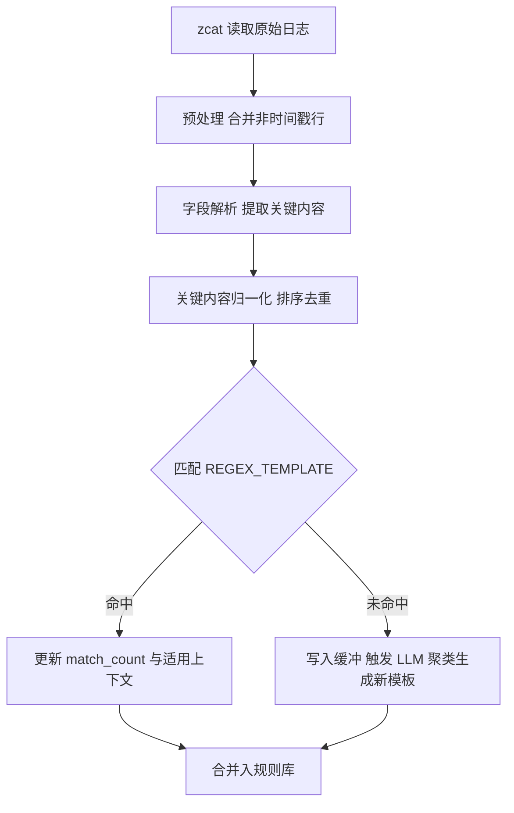
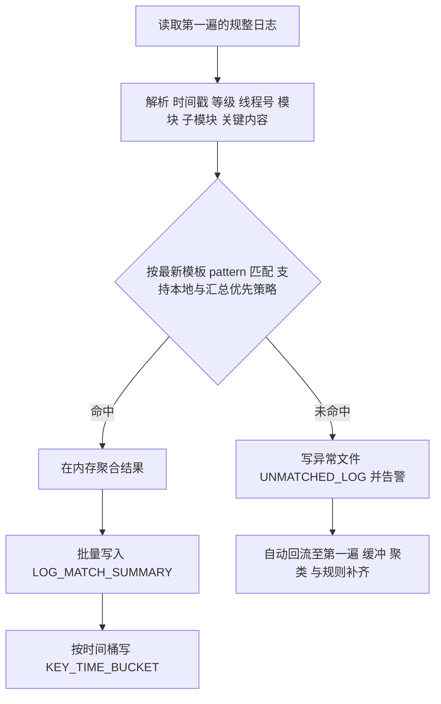

# 智驾日志两遍处理管线

## 快速开始
```bash
python -m logsys.main --config config.yaml init-db
python -m logsys.main --config config.yaml pass1 --file sample.gz
python -m logsys.main --config config.yaml merge-summary
python -m logsys.main --config config.yaml pass2 --file sample.gz
```

## 总流程


## 第二遍统计

